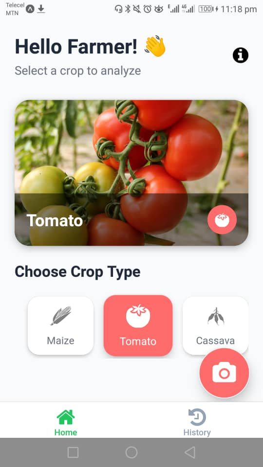
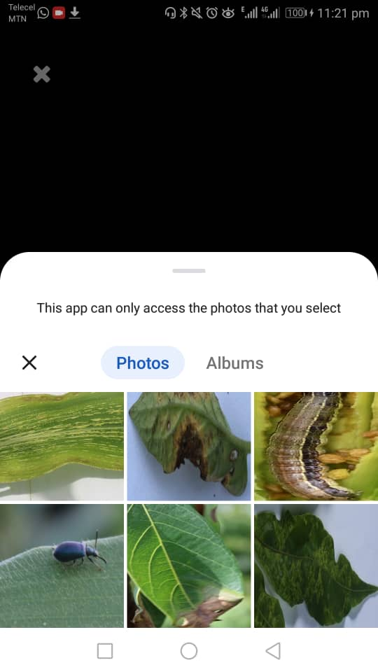
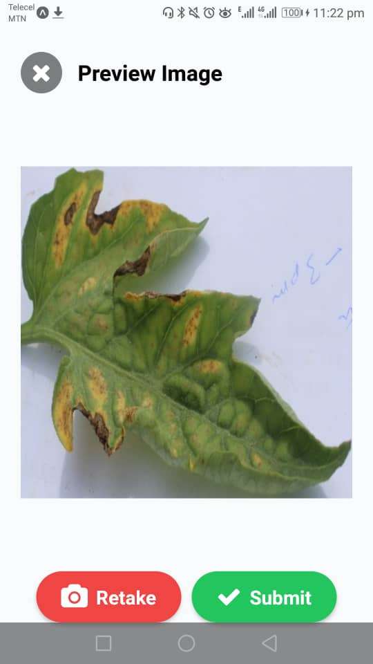
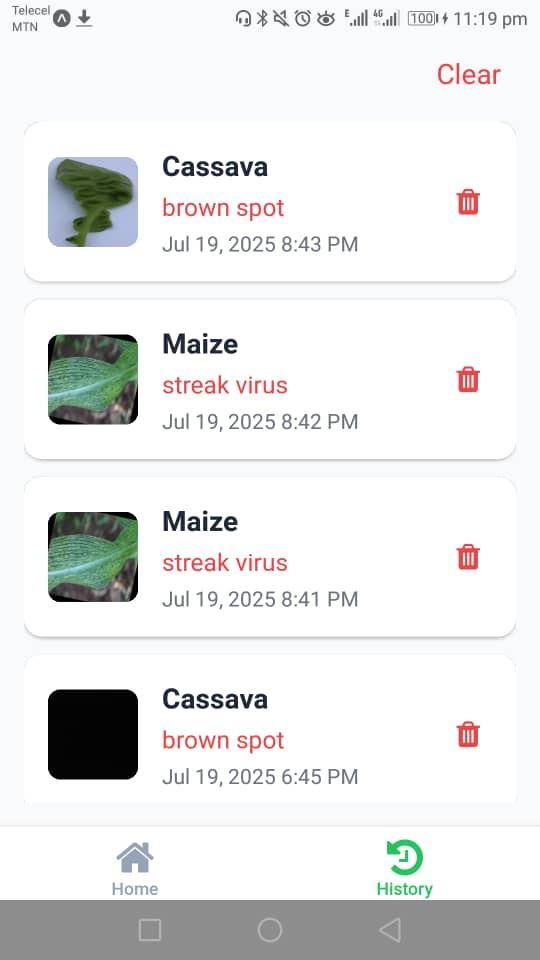
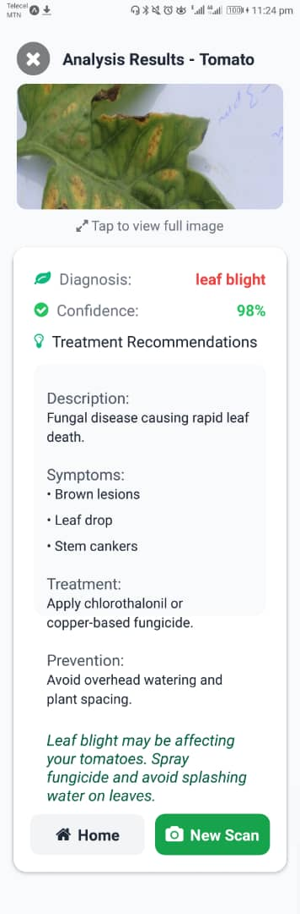
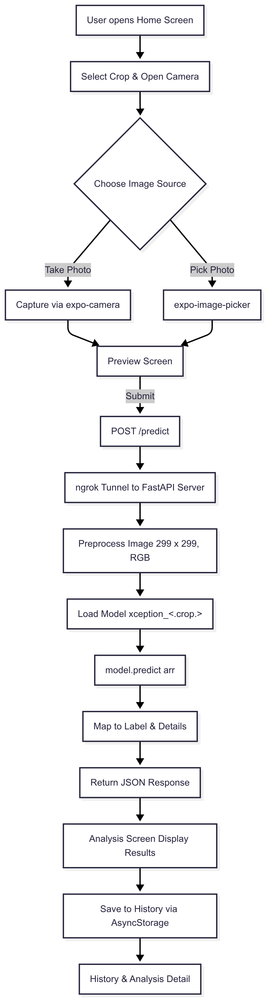

# Crop Guard 📱🌾


## Table of Contents

1. [Project Overview](#crop-guard-📱🌾)
2. [Table of Contents](#📑-table-of-contents)
3. [Frontend Setup & Usage](#🖥️-frontend-setup--usage)
4. [Backend Setup & Usage](#⚙️-backend-setup--usage)
5. [Architecture Diagram](#🏗️-architecture-diagram)
6. [Deployment & Next Steps](#🚢-deployment--next-steps)
7. [Performance Metrics](#📊-performance-metrics)
8. [Future Work](#🌱-future-work)
9. [Acknowledgments](#🙏-acknowledgments)

## Crop Guard 📱🌾

**AI‑Powered Crop Disease Detection**
Crop Guard is a React Native mobile app that helps Ghanaian farmers—especially those just starting out—identify diseases in key crops (maize, cassava, cashew, tomato) using their smartphone camera. By streamlining disease diagnosis, it promotes early intervention and supports Ghana’s agricultural development.

**Challenge Tackled:** Smart Agriculture – Crop Disease Detection
**Tech Stack:**

- **Frontend:** Expo / React Native (see `package.json`)
- **Backend:** Python 3 + FastAPI (see `requirements.txt`)
- **ML Framework:** TensorFlow 2 (Xception fine‑tuned models)
- **Other:** ngrok for local tunneling, CORS enabled

**Folder Structure**

```
Ghana-Hack-AI/
├─ crop-guard-frontend/          # Expo app
│  └─ …                          # React Native code, assets, package.json
├─ crop-guard-backend/           # FastAPI server
│  └─ …                          # API routes, model loader, requirements.txt
├─ crop-disease-models/          # Trained Xception models & notebooks
│  └─ …                          # .keras files, Jupyter notebooks
└─ README.md
```

---

## 🖥️ Frontend Setup & Usage

### 1. Prerequisites

- **Node.js** (≥ 16) & **npm** (or Yarn) installed
- **Expo CLI**:

  ```bash
  npm install -g expo-cli
  ```

### 2. Installation

```bash
# From project root
cd crop-guard-frontend/
npm install

npm run start
```

### 3. Configuration

Update your env file within the `crop-guard-frontend/`

```bash
DEV_BASE_URL = "https://<YOUR_NGROK_SUBDOMAIN>.ngrok-free.app";
```

> You’ll update `<YOUR_NGROK_SUBDOMAIN>` each time you restart ngrok.

### 4. Available Scripts

Run these from the `crop-guard-frontend/` directory:

| Command           | Description                              |
| ----------------- | ---------------------------------------- |
| `npm run start`   | Launch Expo Metro bundler (shows QR)     |
| `npm run android` | Open app on connected Android device/Emu |
| `npm run ios`     | Open app on connected iOS device/Sim     |
| `npm run web`     | Run in web browser                       |
| `npm run test`    | Launch Jest in watch mode                |

### 5. Major Dependencies

_(See full list in [package.json](./crop-guard-frontend/package.json))_

- **TypeScript** – typed JS support
- **Expo & React Native**
- **@react-navigation/native** (navigation)
- **expo-camera**, **expo-image-picker** (image capture/selection)
- **@react-native-async-storage/async-storage** (history persistence)
- **uuid** (unique IDs for images)
- **date-fns** (timestamp formatting)

### 6. Screenshots / Mockups

<table>
  <tr>
    <th>Screen</th>
    <th>Preview</th>
  </tr>
  <tr>
    <td><code>Home</code></td>
    <td></td>
  </tr>
  <tr>
    <td><code>Image-Picker</code></td>
    <td></td>
  </tr>
  <tr>
    <td><code>Camera</code></td>
    <td></td>
  </tr>
  <tr>
    <td><code>Preview</code></td>
    <td></td>
  </tr>
  <tr>
    <td><code>History</code></td>
    <td></td>
  </tr>
  <tr>
    <td><code>Analysis</code></td>
    <td></td>
  </tr>
</table>

---

## ⚙️ Backend Setup & Usage

### 1. Prerequisites

- **Python 3.9+**
- **pip**
- **ngrok** (for local tunneling)

### 2. Installation

```bash
# From project root
cd crop-guard-backend/

python -m venv venv
source venv/bin/activate    # macOS/Linux
venv\Scripts\activate       # Windows

pip install --upgrade pip
pip install -r requirements.txt
```

### 3. Configuration

- Copy or create a `.env` file if you need any secrets (none required by default).
- To start your FastAPI server on port 8000:

  ```bash
  uvicorn app.main:app --reload --host 0.0.0.0 --port 8000
  ```

### 4. Ngrok Tunneling

```bash
# In a separate terminal, from project root
ngrok http 8000
```

- Update your `env`, `DEV_BASE_URL` to the HTTPS URL shown by ngrok.
- Example:

  ```bash
  DEV_BASE_URL = "https://abcd1234.ngrok.io";
  ```

### 5. CORS

CORS is enabled for all origins:

```python
app.add_middleware(
  CORSMiddleware,
  allow_origins=["*"],
  allow_methods=["*"],
  allow_headers=["*"],
)
```

### 6. API Endpoints

| Route             | Method | Description                                                               |
| ----------------- | ------ | ------------------------------------------------------------------------- |
| `/predict/{crop}` | POST   | Send image bytes in body along with model name; returns disease & details |
| `/docs`           | GET    | Interactive Swagger UI                                                    |

- **Predict Example**

  ```bash
    curl -X POST "https://<YOUR_NGROK>.ngrok.io/predict" \
    -F "file=@/path/to/your/image.jpg;type=image/jpeg" \
    -F "model_name=xception_maize"
  ```

  - Preprocesses the image (resize to 299×299, RGB, preprocess_input).
  - Runs `model.predict` → returns `(label, confidence, description_dict)`.

  **Response:**

  ```json
  {
    "label": "leaf blight",
    "confidence": 0.87,
    "details": {
      "description": "Fungal disease that causes dead streaks on leaves.",
      "symptoms": ["Long, greyish lesions", "Yellowing and dying leaves"],
      "treatment": "Apply fungicides like Mancozeb. Ensure good air circulation.",
      "prevention": "Avoid overhead watering; plant in well-spaced rows.",
      "message": "Maize leaf blight detected. Spray fungicide and avoid wetting leaves during irrigation."
    }
  }
  ```

### 7. Model Loading & Prediction Flow

```python
# backend/app/api/predict.py
from tensorflow.keras.models import load_model as keras_load_model
from tensorflow.keras.applications.xception import preprocess_input
from PIL import Image
import numpy as np
from io import BytesIO
import os

CLASS_NAMES = { … }        # mapping crop → class labels
DISEASE_DATA = { … }       # mapping crop → disease metadata
MODEL_DIR = os.path.join(BASE_DIR, "ml-models")

def load_model(name):
    path = os.path.join(MODEL_DIR, f"{name}.keras")
    return keras_load_model(path)

def predict_image(file_bytes, model, model_name):
    img = Image.open(BytesIO(file_bytes)).convert("RGB")
    img = img.resize((299, 299))
    arr = preprocess_input(np.expand_dims(np.array(img), 0))
    preds = model.predict(arr)
    idx = int(np.argmax(preds))
    label = CLASS_NAMES[model_name][idx]
    conf = float(np.max(preds))
    return label, conf, DISEASE_DATA[model_name][label]
```

- On startup, the server lazily loads models via `load_model(crop_name)`.
- When a request arrives, it:

  1. Reads raw image bytes
  2. Converts & resizes to 299×299
  3. Preprocesses for Xception
  4. Runs `model.predict(...)`
  5. Maps output to human-readable labels + metadata

### 8. Folder Structure (Backend)

```

./crop-guard-backend/_
├─ app/_
| ├─ api/_
| | └─ predict.py
| ├─ core/_
| | └─ model.py
| ├─ pipelines/_
| | └─ main_pipeline.py
| ├─ schemas/_
| | └─ predict.py
| ├─ scripts/_
| | ├─ dummy_model.py
| | └─ tens_test.py
| ├─ config.py
| └─ main.py
├─ model/_
| ├─ classifier.pkl
| ├─ xception_cashew.keras
| ├─ xception_cassava.keras
| ├─ xception_maize.keras
| └─ xception_tomato.keras
├─ .fttignore
├─ .gitignore
├─ README.md
├─ render.yml
├─ requirements.txt
└─ .env # (optional)

```

---

## 🏗️ Architecture Diagram

Below is a high‑level flow of how Crop Guard works, from user action in the app to model inference and back:

<p align="center">
    
</p>

## 🚢 Deployment & Next Steps

### Local Testing with ngrok

We’re using **ngrok** for local testing due to model size constraints:

1. **Start FastAPI server**

```bash
   cd crop-guard-backend/
   uvicorn app.main:app --reload --host 0.0.0.0 --port 8000
```

2. **Launch ngrok**

   ```bash
   ngrok http 8000
   ```

### Considered Render Deployment

- We included a `render.yaml` in the repo, but models currently exceed free-tier storage limits.
- Once models are quantized or container size reduced (< 1 GB), uncomment and adjust `render.yaml` to deploy:

  ```yaml
    services:
    - type: web
        name: crop-guard-api
        runtime: python
        buildCommand: pip install -r requirements.txt
        startCommand: uvicorn app.main:app --host=0.0.0.0 --port=10000
        envVars:
        - key: PYTHON_VERSION
            value: "3.10"
  ```

### Future Cloud Deployment

- **Model Optimization:** Apply techniques like TensorFlow Lite conversion or weight quantization to shrink model size.
- **Platform Choices:**

  - **Vercel/Netlify:** Frontend
  - **AWS Lambda / Google Cloud Run / Azure Functions:** Backend API (with TFLite model)

- **CI/CD:** Automate build, tests, and deployment with GitHub Actions.

---

## 📊 Performance Metrics

> _Fill in these placeholders once you have the exact numbers from your teammate._

| Crop    | Accuracy | F1 Score | Inference Time | Model Size |
| ------- | -------- | -------- | -------------- | ---------- |
| Maize   | `<92%>`  | `<0.91>` | `<1.2 s>`      | `<48 MB>`  |
| Cassava | `<95%>`  | `<0.94>` | `<1.1 s>`      | `<47 MB>`  |
| Cashew  | `<90%>`  | `<0.89>` | `<1.3 s>`      | `<49 MB>`  |
| Tomato  | `<93%>`  | `<0.92>` | `<1.1 s>`      | `<46 MB>`  |

> **Tips for Metrics Section:**
>
> - Use averages over a test set of at least 100 images per crop.
> - Measure inference time on a mid‑range Android device (e.g., \~2 GHz, 4 GB RAM).

---

## 🌱 Future Work

- **Model Optimization:** Convert to TensorFlow Lite & quantize weights to reduce size.
- **Offline Support:** Bundle the TFLite model in the app so it works without internet.
- **Extended Crop Coverage:** Add models for additional crops (yam, pepper).
- **Enhanced UI:** Integrate GPS tagging and field mapping of disease hotspots.
- **User Feedback Loop:** Allow farmers to submit images & corrections to improve model over time.
- **Cloud Deployment:** Host backend on Cloud Run or AWS Lambda once models are optimized.

---

## 🙏 Acknowledgments

- **Dataset:** CCMT Dataset for cashew, cassava, maize, and tomato images.
- **Pre-trained Model:** Xception from TensorFlow Hub.
- **Libraries & Tools:**

  - FastAPI, Uvicorn, TensorFlow 2, Hugging Face Transformers
  - Expo, React Native, Expo Camera/Image Picker
  - ngrok for local tunneling

---
