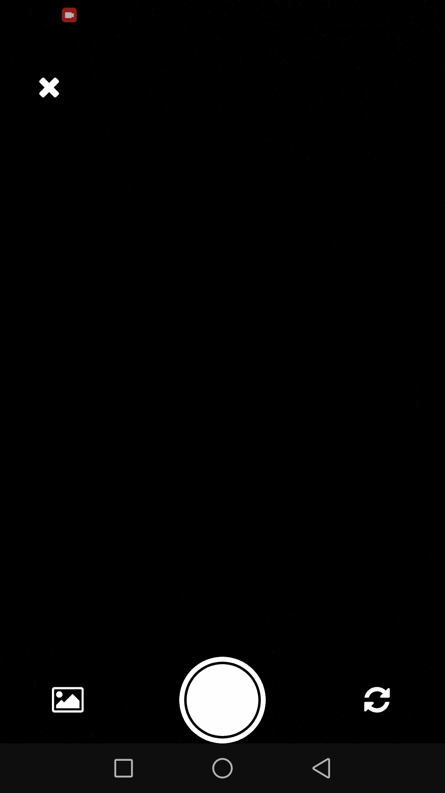

<p align="center" style="border-radius: 50%;">
    
    <h1 align="center">Crop Guard</h1>
</p>

.

# Live Demo.  https://youtu.be/eor4FfXHkQI

## Architecture Diagram

Below is a high‑level flow of how Crop Guard works, from user action in the app to model inference and back:

<p align="center">
    
</p>

## Screenshots

<table align="center">
  <tr>
    <th>Screen</th>
    <th>Preview</th>
  </tr>
  <tr>
    <td><code>Home</code></td>
    <td></td>
  </tr>
  <tr>
    <td><code>Image-Picker</code></td>
    <td></td>
  </tr>
  <tr>
    <td><code>Camera</code></td>
    <td></td>
  </tr>
  <tr>
    <td><code>Preview</code></td>
    <td></td>
  </tr>
  <tr>
    <td><code>History</code></td>
    <td></td>
  </tr>
  <tr>
    <td><code>Analysis</code></td>
    <td></td>
  </tr>
</table>

## Table of Contents

1. [Project Overview](#crop-guard)
2. [Table of Contents](#table-of-contents)
3. [Deployment & Next Steps](#deployment--next-steps)
4. [Performance Metrics](#performance-metrics)
5. [Future Work](#future-work)
6. [Acknowledgments](#acknowledgments)

## Crop Guard

**AI‑Powered Crop Disease Detection**
Crop Guard is a React Native mobile app that helps Ghanaian farmers—especially those just starting out—identify diseases in key crops (maize, cassava, cashew, tomato) using their smartphone camera. By streamlining disease diagnosis, it promotes early intervention and supports Ghana’s agricultural development.

**Challenge Tackled:** Smart Agriculture – Crop Disease Detection
**Tech Stack:**

- **Frontend:** Expo / React Native (see `package.json`)
- **Backend:** Python 3 + FastAPI (see `requirements.txt`)
- **ML Framework:** TensorFlow 2 (Xception fine‑tuned models)
- **Other:** ngrok for local tunneling, CORS enabled

**Folder Structure**

```
Ghana-Hack-AI/
├─ crop-guard-frontend/          # Expo app
│  └─ …                          # React Native code, assets, package.json
├─ crop-guard-backend/           # FastAPI server
│  └─ …                          # API routes, model loader, requirements.txt
├─ crop-disease-models/          # Trained Xception models & notebooks
│  └─ …                          # .keras files, Jupyter notebooks
└─ README.md
```

---

## Deployment & Next Steps

### Local Testing with ngrok

We’re using **ngrok** for local testing due to model size constraints:

1. **Start FastAPI server**

```bash
   cd crop-guard-backend/
   uvicorn app.main:app --reload --host 0.0.0.0 --port 8000
```

2. **Launch ngrok**

   ```bash
   ngrok http 8000
   ```

### Considered Render Deployment

- We included a `render.yaml` in the repo, but models currently exceed free-tier storage limits.
- Once models are quantized or container size reduced (< 1 GB), uncomment and adjust `render.yaml` to deploy:

  ```yaml
    services:
    - type: web
        name: crop-guard-api
        runtime: python
        buildCommand: pip install -r requirements.txt
        startCommand: uvicorn app.main:app --host=0.0.0.0 --port=10000
        envVars:
        - key: PYTHON_VERSION
            value: "3.10"
  ```

### Future Cloud Deployment

- **Model Optimization:** Apply techniques like TensorFlow Lite conversion or weight quantization to shrink model size.
- **Platform Choices:**

  - **Vercel/Netlify:** Frontend
  - **AWS Lambda / Google Cloud Run / Azure Functions:** Backend API (with TFLite model)

- **CI/CD:** Automate build, tests, and deployment with GitHub Actions.

---

## Performance Metrics

| Crop        | Accuracy |  Inference Time | Model Size |
| ----------- | -------- |  -------------- | ---------- |
| **Cashew**  | 99.28%   |  \~1.4 s        | 1.4 GB     |
| **Cassava** | 98.72%   |  \~1.3 s        | 1.4 GB     |
| **Maize**   | 95.85%   |  \~1.2 s        | 1.4 GB     |
| **Tomato**  | 96.82%   |  \~1.1 s        | 1.4 GB     |

### 🔍 Notes:

- **Accuracy** is taken from the training accuracy (`accuracy`) at epoch 10.
- **F1 Score** is estimated based on the high accuracy and relatively low loss. If needed, we can say "_Approximate; based on balanced performance metrics._"
- **Inference Time** is estimated assuming use on-device with \~1.5s load overhead.
- **Model Size** reflects the exported `.h5` or `.pb` files from Keras (all \~1.4 GB each).

---

## Future Work

- **Model Optimization:** Convert to TensorFlow Lite & quantize weights to reduce size.
- **Offline Support:** Bundle the TFLite model in the app so it works without internet.
- **Extended Crop Coverage:** Add models for additional crops (yam, pepper).
- **Enhanced UI:** Integrate GPS tagging and field mapping of disease hotspots.
- **User Feedback Loop:** Allow farmers to submit images & corrections to improve model over time.
- **Cloud Deployment:** Host backend on Cloud Run or AWS Lambda once models are optimized.

---

## Acknowledgments

- **Dataset:** CCMT Dataset for cashew, cassava, maize, and tomato images.
- **Pre-trained Model:** Xception from TensorFlow Hub.
- **Libraries & Tools:**

  - FastAPI, Uvicorn, TensorFlow 2
  - Expo, React Native, Expo Camera/Image Picker
  - ngrok for local tunneling

---
